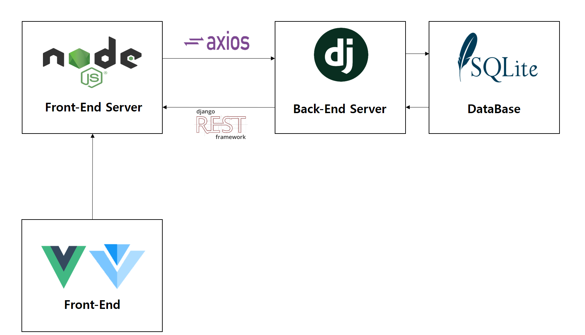

# 


### 버전관리

```
1. 이슈는 항상 jira에서 관리한다.
2. '{jira 이슈} | 진행상황(진행중, 완료) | {기능명}'과 같이 commit을 작성한다.
```


### 팀원

---

> 정용원, 주환동, 박슬기, 강민석, 나진석


### 프로젝트명

-----

**D_LINK**

> 술을 마시다에 따온 Drink의 의미와 관계를 이어주다의 Link의 중의적인 표현에서 비롯됨


### 프로젝트  개요 및 목표

---

> 현대인에게는 음주가 빠질 수 없는 하나의 힐링요소가 되면서 현 시점에서 자신이 알고있는 주종, 안주, 소품 등의 정보를 SNS를 활용해 공유하는 사용자 행동이 활발히 일어나고 있다.  포스트 코로나 시대에 들어서면서 혼술, 홈술 등 외부에서 음주를 즐기기보다는 집에서 음주를 즐겨야하는 필요성이 커지고 있다. 이러한 흐름에 맞춰 술과 관련된 커뮤니티, 정보 공유 등을 할 수 있는 웹 홈페이지인 **D_Link**를 개발하였다.


**프로젝트 기능**

---

> - 피드
> - 게시물 검색
> - 게시물 작성
> - 컨텐츠
>   - Yes or No 음주 취향찾기
>   - VS 뭐가 국룰일까
>   - 칵테일 레시피
>   - 화상채팅 
> - 마이페이지

 

### 시스템 아키텍처(확정아님)

---

