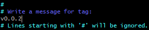

# 1. Gitflow

`gitflow`는 병렬작업을 위한 브랜치 관리 전략이며 핵심이 되는 다섯종류의 브랜치를 중심으로 버전을 관리할 수 있게 해준다. 


## 1.1 개념 

다음 이미지는 `gitflow`의 동작을 잘 나타낸다. `gitflow`는 아래와 같이 `master`, `hotfixes`, `release`, `develop`, `feature`의 다섯개 핵심브랜치로 동작한다(`support`등의 다른 브랜치도 존재함). 


>**gitflow 흐름도** | 출처: [nvie.com](https://nvie.com/posts/a-successful-git-branching-model/)


### 핵심 브랜치

- `master`: 프로젝트의 최종 버전을 나타내는 브랜치로 절대 삭제되면 안되는 브랜치
- `hotfix`: `master`에서 확인된 버그들을 수정하는 브랜치
- `release`: 배포전에 QA를 진행할 브랜치(버그픽스도 해당 브랜치에서 진행)
- `develop`: 개발의 주축이 되는 브랜치로 `feature`에서 개발된 단위기능들이 합쳐지는(merge) 브랜치
- `feature`: 단위기능을 개발하는 브랜치로, 가장 많이 사용되며 사용후에 삭제되는 휘발성 브랜치


### 개발흐름

1. `master` 브랜치에서 시작.
2. `master`와 같은 내용의 `develop`이 생성, 해당 브랜치가 개발을 위한 merge브랜치가 됨.
3. 개발이 필요한 기능에 따라 `feature`를 생성하고 `develop`에 병합.
4. 기능이 완성되면 `develop`과 같은 내용의 `release`를 생성하고 QA를 진행.
5. QA에서 나온 버그들을 `release`에서 수정.
6. 수정이 완료된` release`를 `master`와 `develop`으로 보내고 `master`에서는 버전을 추가하고 배포.
7. 추후 `master`에서 수정이 필요할 경우 `hotfix`를 만들어서 수정.


## 1.2 사용법

`gitflow`를 시작하는 것은 어렵지 않다. os에 맞는 git(git bash)가 깔려있다면 설치할 필요없이 바로 사용가능하다.

해당 사용법은 `gitflow`의 기초사용법을 작성했으며, upstream-origin의 워크플로우에서의 방법은 `(upstream-origin)`와 같이 체크해두었다.


### 1.2.1 시작하기

초기화시에 branch에 관련된 여러 설정을 물어보는데 변동이 없을시에는 `Enter`만 누르면 된다.

```bash
$ git flow init
No branches exist yet. Base branches must be created now.
Branch name for production releases: [master]
Branch name for "next release" development: [develop]

How to name your supporting branch prefixes?
Feature branches? [feature/]
Bugfix branches? [bugfix/]
Release branches? [release/]
Hotfix branches? [hotfix/]
Support branches? [support/]
Version tag prefix? []
```


### 1.2.2 feature

`gitflow`에서는 기존의 branch생성 명령어와 다르게 별도의 명령어를 사용하여 `feature`를 생성한다.


#### 브랜치 생성

`feature`를 생성하면 `feature/`가 브랜치명 앞에 붙으므로 **간단한 기능명**을 명령어에 입력하면 된다.

```bash
$ git flow feature start {기능명}
```

```bash
# 브랜치가 만들어진 것을 확인할 수 있다.
$ git branch
  develop
* feature/test
  master
```


#### 브랜치 병합

`gitflow`를 이용하면 브랜치를 개발하고 머지하고, 또 브랜치를 삭제하는 불편한 과정을 거칠 필요가 없다. 간단한 명령어 하나면 `feature`의 commit을 `develop`에 merge해주고 브랜치까지 삭제해준다.

```bash
# 이 때, feature/{기능명}이 아닌 기능명만 입력하면 된다.
$ git flow feature finish test
```

```bash
# 브랜치가 삭제된 것을 확인할 수 있다.
$ git branch
* develop
  master
```

```bash
# feature 'test'의 commit이 develop으로 병합된 것을 확인할 수 있다.
$ git log
commit 21f5585e04ff7caf84ef4a6fc31376bca5c27f09 (HEAD -> develop)
Author: minseokkang8571 <kangminseok1001@gmail.com>
Date:   Mon Jul 20 08:47:26 2020 +0900

    test.txt

commit de471327838d1dfd59538e371d6a4283d4611ce2 (master)
Author: minseokkang8571 <kangminseok1001@gmail.com>
Date:   Mon Jul 20 08:45:02 2020 +0900

    Initial commit
```


#### 브랜치 삭제

`feature finish`를 이용하면 사용한 브랜치를 삭제하지 않아도 되지만, 잘못 생성한 브랜치가 있을 경우 다음 명령어로 삭제한다. **브랜치를 삭제하기전에 다른 브랜치로 checkout을 해야함.**

```bash
$ git branch -D {브랜치명}
```


#### 공동작업(게시)

기능을 공동으로 개발하고 싶은경우 `publish`를 이용해 원격서버에 개발내용을 올리고 공유할 수 있다. 기능을 게시할 때는 다음의 명령어를 사용한다.

```bash
$ git flow feature publish {기능명}
```

게시된 기능을 가져올 때는 다음 명령어를 사용한다.

```bash
$ git flow feature pull origin {기능명}
```


### 1.2.3 release

배포를 위한 QA브랜치로 메타 데이터등을 사용할 수 있다. `release`의 경우 finish되면 해당 커밋을 master가 가르키게 되므로 배포버전을 올릴만큼 개발이 된 이후에 `release`를 만들도록 하자.


#### 브랜치 생성

`develop`브랜치로부터 내용을 가져와 브랜치를 생성한다. 명령어에는 **버전**을 작성한다.

```bash
$ git flow release start v0.0.1
Switched to a new branch 'release/v0.0.1'
```


#### 게시 or upstream에 올리기

- 게시

`release`는 여러 개발자들이 commit을 할 수 있어야 하므로 게시를 하여 수정할 수 있다.

```bash
$ git flow release publish RELEASE
```


- `release`를 `upstream`에 push하기(upstream-origin)

upstream-origin의 형태로 워크플로우를 구성한 경우 `upstream`에 push하여, 개발자들이 pull하고 QA를 진행할 수 있다.

```bash
# upstream 원격저장소로 등록
$ git remote add upstream {upstream 주소}
```

```bash
$ git push upstream {브랜치명}
```


#### 버그픽스(upstream-origin)

> 참조: [우아한 형제들 기술 블로그](https://woowabros.github.io/experience/2017/10/30/baemin-mobile-git-branch-strategy.html)

`release`에서 발견한 버그의 경우 기존의 브랜치 생성법대로 생성하고 pull request(이하 PR)를 하는 방향으로 진행한다. 실제로 **upstream-origin**의 워크플로우에서는 `develop`, `bugfix`, `hotfix`등의 브랜치를 아래와 같이 **PR - merge를 통해 관리**해야한다.

1. 버그 픽스를 위한 브랜치를 생성
2. 버그를 수정
3. origin으로 버그 픽스 브랜치를 push
4. `release`에 버그 픽스 브랜치를 PR
5. 리뷰를 통해 merge


#### 릴리즈 완료

릴리즈를 완료하고 `master`와 `develop`에 병합한다.

```bash
$ git flow release finish {버전}
```

위의 명령어를 사용하고 나면 태그를 붙일 수 있다.


> **release 태그 설정.  초기에 주석처리되어있다.**

태그를 붙인 이후에 자동으로 `develop`과 병합하게 된다.

```bash
$ git log
commit a7119a46ecbe7ddd0b80f83c42091102c6418969 (HEAD -> develop)
Merge: 01f1bcb 90612ad
Author: minseokkang8571 <kangminseok1001@gmail.com>
Date:   Mon Jul 20 08:48:26 2020 +0900

    Merge tag 'v0.0.1' into develop

    v0.0.1

commit 90612ad530cba6467f6b75412bd7e12a17b5b15b (tag: v0.0.1, master)
Merge: 21f5585 01f1bcb
Author: minseokkang8571 <kangminseok1001@gmail.com>
Date:   Mon Jul 20 08:47:26 2020 +0900

    Merge branch 'release/v0.0.1'
```


### 1.2.4 hotfix

`master`에서의 버그나 변경사항을 수정한다.


#### 브랜치 생성

```bash
$ git flow hotfix start {버전}
```

```bash
# hotfix 브랜치가 생성된 것을 확인할 수 있다.
$ git branch
  develop
* hotfix/v0.0.1
  master
  release/v0.0.1
```


#### 핫픽스 완료

```bash
$ git flow hotfix finish {버전}
```

위의 명령어를 사용하고나면 다음과 같이 태그명을 붙일 수 있다.



> **hotfix 태그설정**

```bash
# 핫픽스 완료후에 태그가 붙은 것. commit을 master가 가르키고 있는 것을 볼 수 있다.
$ git log
commit 21f5585e04ff7caf84ef4a6fc31376bca5c27f09 (tag: v0.0.2, master)
Author: minseokkang8571 <kangminseok1001@gmail.com>
Date:   Mon Jul 20 09:42:26 2020 +0900

    test.txt
```


`release`파트에서도 언급했지만 `release`와 `hotfix`는 완료 후에 master가 commit을 가르키게 되며 설정한 태그가 붙게된다.


> **release와 hotfix 완료시 master**


# 2. upstream-origin 워크플로우

`gitflow`의 개념만으로 협업을 하게 될 경우, 누구나 `master`를 수정할 수 있고 하나의 origin을 가지기 때문에 코드작성에 소극적일 수 밖에 없다. 다양한 방식으로 안정성있는 협업을 하기 위해서는 개인 별로 upstream을 fork하고 아래와 같은 워크 플로우를 형성하는게 바람직하다.


> **오픈소스, 협업에서 사용하는 저장소 구조** | 출처: 이미지 내 삽입


위의 구조는 `upstream`이라고 하는 메인 원격 저장소, 각각의 개발자들이 fork를 통해 생성한 `origin` 그리고 실제 워크 디렉토리인 `local`로 이루어진다.

실제 개발은 `local`에서 이루어지며, 각 개발자들은 `feature`에서 개발하고 `develop`으로 병합하는 방식으로 개발을 진행한다. 이 때 사용되는 원격 저장소는 `origin`이므로 메인 저장소인 `upstream`에 영향을 끼치지 않는다.

기능적인 구현이 완료되고 `origin`의 `develop`에 문제가 없을 경우, 개발자는 `upstream`에 PR를 하고 프로젝트의 maintainer가 각 개발자들의 PR을 확인한 후 merge를 진행한다. 이로서 upstream이 갱신되므로 각 개발자들은 새로운 개발을 착수할 때마다 `upstream`으로 부터 `origin`으로 pull을 하는 과정을 거쳐야한다([해당문서참고](https://github.com/minseokkang8571/TIL/blob/master/linux/git/fork한%20저장소%20싱크%20맞추기/fork한%20저장소%20싱크%20맞추기.md)).

앞서 버그픽스에서 언급된 것처럼 해당 워크플로우에서는 `develop`, `bugfix`, `hotfix`등의 브랜치를 **PR - merge를 통해 관리**하도록 한다. 

