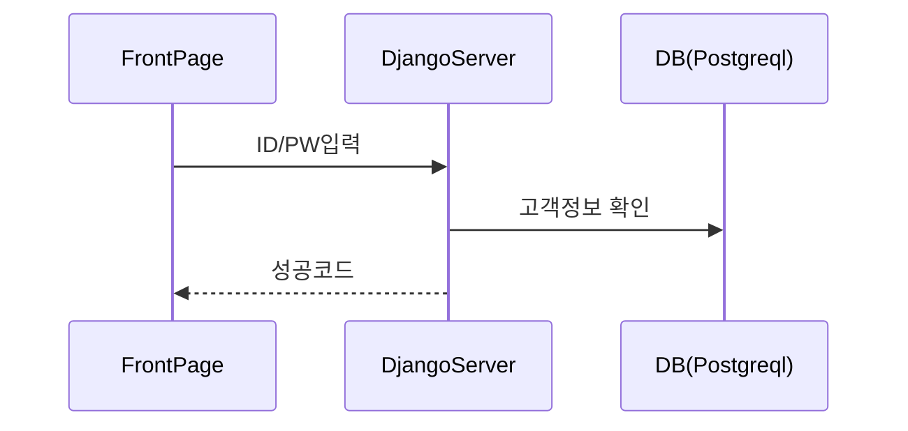
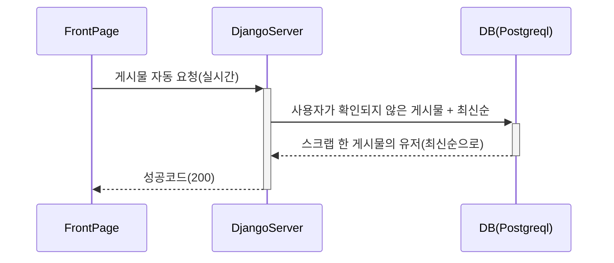

## 전반적인 시퀸스 다이어그램 

````mermaid
sequenceDiagram

	고객->>+홈: 로그인 시도
	고객->>회원가입: 회원가입 페이지 
	회원가입->>피드: 가입완료 후 피드로 이동
	홈->>+피드 : 피드로 이동 
	피드-->>고객 : 뉴스피드 반환(비동기)
	피드->>+검색 : 검색창 이동(router-link)
	검색->>-검색 : 키워드 검색(DB 조회)
	검색-->>고객 : 검색 게시물 반환
  피드->>+업로드 : 업로드 이동(router-link)
  업로드->>업로드: 게시물 작성(DB 저장)
  업로드-->>고객: 게시물 반환
	피드->>+마이페이지 : 마이페이지 이동(router-link)
	마이페이지-->>- 고객 : 로그인한 계정 데이터 반환(본인 게시물, 스크랩 게시물 수, 스크랩 당한 수) 
	피드->>+컨텐츠 : 컨텐츠 이동(router-link)
	컨텐츠-->>-고객 : 컨텐츠 라우터링크 반환
	


````

----


## 1. 로그인

### 일반로그인



### 소셜로그인

````mermaid
sequenceDiagram
FrontPage  ->>+SocialAPI:소셜로그인 확인요청
SocialAPI->>-SocialAPI: 고객정보 확인
SocialAPI-->>FrontPage: access_token 받음
FrontPage->>+DjangoServer: acces_token 전송
DjangoServer-->>-SocialAPI: 계정정보요청
SocialAPI->>+DjangoServer: 계정정보 전송
DjangoServer-->>-DB(Postgreql):token 생성 및 DB 저장
DB(Postgreql)-->>DjangoServer: token 정보
DjangoServer-->>FrontPage: 성공코드(200)
````


## 2. 회원 가입

실명 인증은 별도의 실명 인증 서버를 거쳐 OK를 받으면 저장한다. 

#### 인증 성공의 경우

````mermaid
sequenceDiagram


FrontPage ->> DjangoServer : 인증 요청, 회원정보 입력 및 전송. 

DjangoServer ->> DB(Postgreql) : 회원정보 저장
DjangoServer -->> FrontPage : 성공코드


````

#### 인증 실패인 경우

````mermaid
sequenceDiagram

FrontPage ->> DjangoServer : 인증 요청
DjangoServer -->> FrontPage : [notOK]
FrontPage ->> FrontPage : 회원가입 초기 페이지 이동
````

## 3. 피드




## 4. 게시판

### 게시물 작성 / 댓글 / 스크랩 / 검색

````mermaid
sequenceDiagram


FrontPage ->>+ DjangoServer : 게시물(글, 해쉬태그, 위치 정보 전송)

DjangoServer ->>+ DB(Postgreql) : 게시물 + PK값 저장
DB(Postgreql) -->>- DjangoServer : 게시물 
DjangoServer -->>- FrontPage : 성공코드(200)
FrontPage ->>+ DjangoServer : 댓글 작성
DjangoServer ->>+ DB(Postgreql) : 댓글 + PK 저장
DB(Postgreql) -->>- DjangoServer : 댓글
DjangoServer -->>- FrontPage : 성공코드(200)


FrontPage ->>+ DjangoServer : 스크랩 

DjangoServer ->>+ DB(Postgreql) : 스크랩 + 유저 pk 저장
DjangoServer -->>- FrontPage : 성공코드(200)

FrontPage ->>+ DjangoServer : 키워드로 매칭 게시물 요청
DjangoServer ->>+ DB(Postgreql) : 키워드와 매칭되는 해쉬태그가 포함된 게시물찾기
DB(Postgreql)-->>- DjangoServer : 매칭되는 게시물
DjangoServer -->>- FrontPage : 성공코드(200)
````


## 5. 마이페이지

````mermaid
sequenceDiagram


FrontPage ->>+ DjangoServer : 로그인한 유저 정보 요청
DjangoServer ->> DB(Postgreql) : token 값으로 유저매칭
DB(Postgreql) -->> DjangoServer : 게시물 수, 스크랩 당한수, 게시물, 스크랩 게시물
DjangoServer -->>- FrontPage : 성공코드(200)
````


## 6. 컨텐츠 : VS / 칵테일 레시피 정보 및 큐레이션


````mermaid
sequenceDiagram

FrontPage ->>+ LocalStroage : 칵테일 레시피 썸네일
LocalStroage -->>- FrontPage : 칵테일 레시피 포스터
FrontPage ->>+ LocalStroage : 취향설문 데이터 (6개)
Note right of LocalStroage: 칵테일 : 저장된 설문에 대한 가중치를 바탕으로 2가지 칵테일 선택
LocalStroage -->>- FrontPage : 2가지 칵테일 포스터

FrontPage ->>+ DjangoServer : 투표
DjangoServer ->>+DB(Postgresql): VS 투표데이터 저장
DB(Postgresql) -->>-DjangoServer : 투표(All)
DjangoServer -->>- FrontPage : 성공코드(200)
FrontPage ->>+ DjangoServer: 실시간 채팅 
DjangoServer ->>+ DB(redis): 실시간 채팅 저장
DB(redis) -->>- DjangoServer : 채팅
Note right of DB(redis): 투표한 주제에 따라서 라벨링
DjangoServer -->>- FrontPage : 성공코드(200)


````


