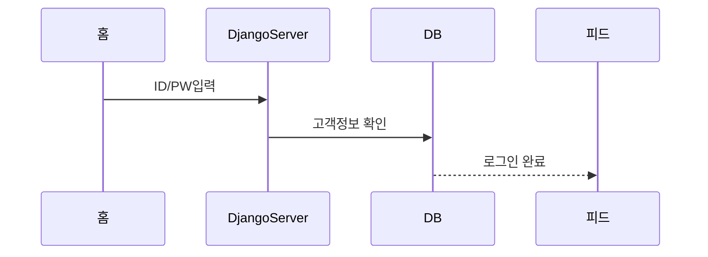

````mermaid
sequenceDiagram
	autonumber
	고객->>+홈: 로그인 시도
	고객->>회원가입: 회원가입 페이지 
	회원가입->>피드: 가입완료 후 피드로 이동
	홈->>+피드 : 피드로 이동 
	피드-->>고객 : 뉴스피드 반환(비동기)
	피드->>+검색 : 검색창 이동(router-link)
	검색->>-검색 : 키워드 검색(DB 조회)
	검색-->>고객 : 검색 게시물 반환
  피드->>+업로드 : 업로드 이동(router-link)
  업로드->>업로드: 게시물 작성(DB 저장)
  업로드-->>고객: 게시물 반환
	피드->>+마이페이지 : 마이페이지 이동(router-link)
	마이페이지-->>- 고객 : 로그인한 계정 데이터 반환(본인 게시물, 스크랩 게시물 수, 스크랩 당한 수) 
	피드->>+컨텐츠 : 컨텐츠 이동(router-link)
	컨텐츠-->>-고객 : 컨텐츠 라우터링크 반환
	


````


## 로그인



