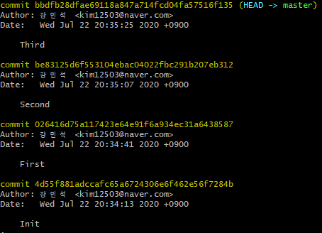
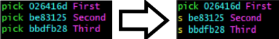
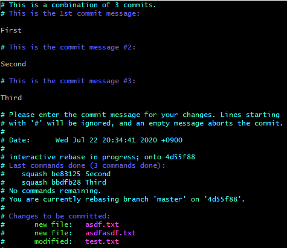
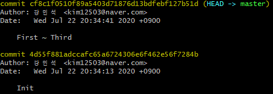

# 1. squash

로컬에서 작업을 하고 많은 이력을 남겼을 때, 그간의 과정을 이력으로 남길 필요가 없어 하나의 commit으로 바꾸고 싶을 때 사용하는 명령어이다(혹은 reset하고 다시 커밋해도 된다) .

`rebase`를 사용하므로 꼭 로컬에서만 사용하도록 하자.

First, Second, Third의 세 가지 커밋이 있는 경우에서 이력을 하나로 만들어보자. 실제로 다음과 같이 이력이 존재한다.



> **번잡한 이력**


우리는 위의 결과물을 하나의 commit으로 합치려고 한다. 이를 위해 `rebase`명령어를 사용한다. 

```bash
$ git rebase -i 4d55f881adccafc65a6724306e6f462e56f7284b
```


위의 명령어를 사용하면 다음과 같이 vim편집기가 열리는데 여기서 합쳐질 commit들의 `edit`을 `s`로 바꿔준다.



> **squash할 commit을 설정**


위의 편집기를 저장하고 나가면 다음과 같이 변경사항을 알려주는 편집기가 열린다.



> **squash로 인한 변경사항**


위의 코드를 다음과 같이 변경하면 합쳐지는 commit의 메세지를 정할 수 있다.


> **새로운 commit의 메세지**


`git log` 명령어를 통해 이력을 확인하면 다음과 같이 합쳐진 것을 확인할 수 있다.



> **합쳐진 commit들**